# Adil Sukumar

**Developer building thoughtful products across software, data, and connected hardware.**

[Portfolio](https://adilsukumarwebsite.vercel.app) · [LinkedIn](https://linkedin.com/in/adilsukumar) · [Email](mailto:adilsukumar24@gmail.com) · [Blog](https://adilsukumar.blogspot.com)

I turn ambitious ideas into working products—from interactive web apps and AI experiments to bioinformatics pipelines and embedded systems. I care about clear thinking, dependable engineering, and making things people can actually use.

## Selected work

### [A Map of Memories](https://github.com/adilsukumar/AMOM-A_Map_Of_Memories)

A living world map where people attach stories, feelings, and memories to real places. Built with React, TypeScript, Leaflet, and Supabase.

### [SCLC Somatic Variant Analysis](https://github.com/adilsukumar/SCLC-Somatic-Variant-Analysis)

A bioinformatics pipeline for analysing somatic variants in circulating tumour cells, using GATK Mutect2, SnpEff, and AWS.

### [Spendture](https://github.com/adilsukumar/Spendture_Website)

A financial management platform designed to make spending easier to track, understand, and improve.

## Toolkit

- **Web:** TypeScript, JavaScript, React, HTML, CSS, Supabase, Firebase
- **Data & AI:** Python, PyTorch, bioinformatics workflows
- **Systems & hardware:** C++, ESP32, Arduino, Linux
- **Infrastructure:** Git, Docker, AWS

## Open source

I enjoy contributing to projects where I can improve the product as well as the code—from performance work and deployment fixes to feature development and documentation.

Repositories I've contributed to

<!-- CONTRIB:START -->

<a href="https://github.com/RAMINENI-TEJA-24MEI10040/TRUSTLAYERLABS-cyber-awareness"><picture><source media="(prefers-color-scheme: dark)" srcset="profile/contrib/ramineni-teja-24mei10040-trustlayerlabs-cyber-awareness-dark.svg" /></picture></a>
<a href="https://github.com/neurobyte-vitb/.github"><picture><source media="(prefers-color-scheme: dark)" srcset="profile/contrib/neurobyte-vitb--github-dark.svg" /></picture></a>
<a href="https://github.com/neurobyte-vitb/Website"><picture><source media="(prefers-color-scheme: dark)" srcset="profile/contrib/neurobyte-vitb-website-dark.svg" /></picture></a>
<a href="https://github.com/Pawsitive-Diagnostics/.github"><picture><source media="(prefers-color-scheme: dark)" srcset="profile/contrib/pawsitive-diagnostics--github-dark.svg" /></picture></a>
<a href="https://github.com/Pawsitive-Diagnostics/Pawsitive_Diagnostics_App"><picture><source media="(prefers-color-scheme: dark)" srcset="profile/contrib/pawsitive-diagnostics-pawsitive-diagnostics-app-dark.svg" /></picture></a>
<a href="https://github.com/snehaldixitofficial/SkillNests"><picture><source media="(prefers-color-scheme: dark)" srcset="profile/contrib/snehaldixitofficial-skillnests-dark.svg" /></picture></a>

<!-- CONTRIB:END -->

---

If you're working on something ambitious and useful, [I'd like to hear about it](mailto:adilsukumar24@gmail.com).
