    
     
    

 

# 💫 About Me:

   Adil Sukumar, Student, Builder & Learner; focus -> C++, Python, Full-Stack Web Dev; status -> Open to AI open-source collaborations" />

 

- 🌍 My Website: https://adilsukumarwebsite.vercel.app/
- 📫 How to reach me: adilsukumar24@gmail.com
- 😄 Pronouns: He/Him

# 💻 Tech Stack:

  

 

  
<b>💁‍♂️ Click here to know more... [Expand / Collapse]</b>

 

<!-- Left-aligned text only -->

# 📊 GitHub Stats:

    <picture>
      <source media="(prefers-color-scheme: dark)" srcset="profile/stats-dark.svg" />
      
    </picture>
    <picture>
      <source media="(prefers-color-scheme: dark)" srcset="profile/top-langs-dark.svg" />
      
    </picture>

## ✍️ Dev Quote:
"I build robots, write code, and learn every day. I focus on doing the actual work and creating things that matter, rather than just decorating a profile."

## 🏆 Trophies:

  <picture>
    <source media="(prefers-color-scheme: dark)" srcset="profile/trophy-dark.svg" />
    
  </picture>

## 📈 Activity Graph:

  <picture>
    <source media="(prefers-color-scheme: dark)" srcset="https://github-readme-activity-graph.vercel.app/graph?username=AdilSukumar&bg_color=00000000&color=6DD5FA&line=A18AFF&point=84C2C0&area=true&area_color=6DD5FA&title_color=6DD5FA&text_color=c9d1d9&border_color=30363d" />
    
  </picture>

# 🌟 Open Source Contributions

*(Auto-generated from live GitHub contribution data on every update — every external repo shows up here automatically, nothing hand-typed)*

<!-- CONTRIB:START -->
<!-- CONTRIB:END -->

## 🐍 Contribution Snake

# 🛜 Connect Here:

  

<!---
AdilSukumar/AdilSukumar is a ✨ special ✨ repository because its `README.md` (this file) appears on your GitHub profile.
You can click the Preview link to take a look at your changes.
--->
